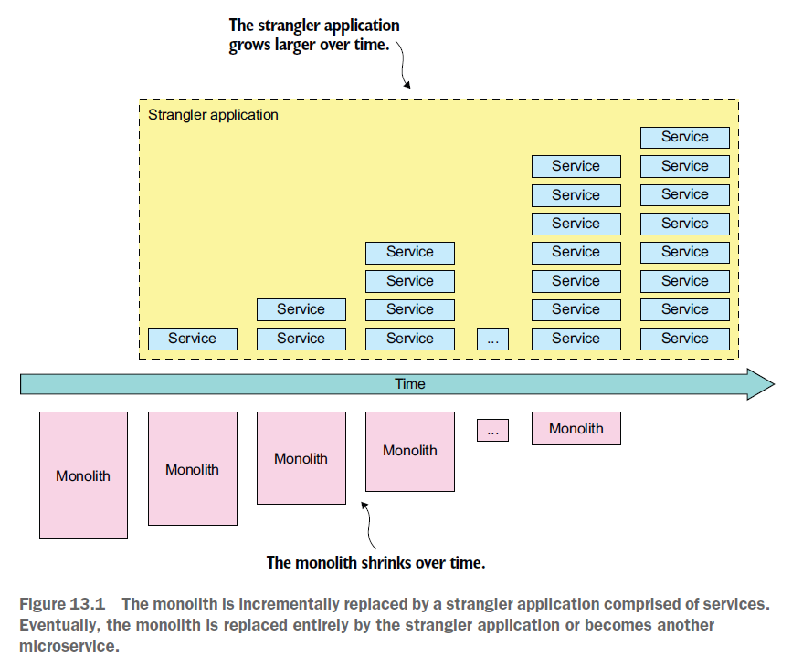
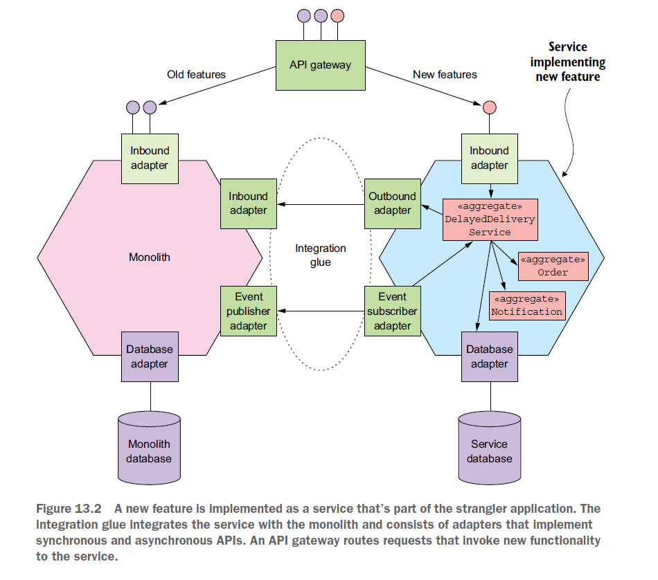

# 목차

```
13.1 마이크로서비스 리팩터링 개요
__13.1.1 모놀리스를 왜 리팩터링하는가?
__13.1.2 모놀리스 옥죄기
13.2 모놀리스 → 마이크로서비스 리팩터링 전략
__13.2.1 새 기능을 서비스로 구현한다
__13.2.2 표현 계층과 백엔드를 분리한다
__13.2.3 기능을 여러 서비스로 추출한다
13.3 서비스와 모놀리스 간 협동 설계
__13.3.1 통합 글루 설계
__13.3.2 서비스와 모놀리스에 걸쳐 데이터 일관성 유지
__13.3.3 인증/인가 처리
13.4 새 기능을 서비스로 구현: 배달 실패한 주문 처리
__13.4.1 배달 지연 서비스 설계
__13.4.2 배달 지연 서비스를 위한 통합 글루 설계
13.5 모놀리스 분해: 배달 관리 추출
__13.5.1 현행 배달 관리 기능
__13.5.2 배달 서비스 개요
__13.5.3 배달 서비스의 도메인 모델 설계
__13.5.4 배달 서비스의 통합 글루 설계
__13.5.5 배달 서비스와 상호 작용할 수 있게 모놀리스를 변경
13.6 마치며
```

# 정리 전략?

- 전부 정리는 NO
- 핵심중에서 꼭 적고 가야겠다 싶은 것만!
- 나의 생각을 섞어서 적을것..!
- 떠오르는 것 먼저 간단하게..!

# 내용

## 13.1 마이크로서비스 리팩터링 개요

### \_\_13.1.1 모놀리스를 왜 리팩터링하는가?

- 유지 보수에 오래 걸리니까!, 테스트도 어렵고, 개발 공수도 많이 들고(msa에 비해서)

### \_\_13.1.2 모놀리스 옥죄기

- 옥죄기를 하길 할건데 단계적으로 바꿔야한다!
- 스트랭글러 애플리케이션 패턴. Strangler Application Pattern


#### 값을 조기에 자주 검증
단계적 리팩터링은 투자에 따른 보상이 즉시적이다. 때문에 조금씩 리팩터링 하면서 새 기술스택 도입과 데브옵스 스타일로 개발/전달 하면 효과적이다. 
 애플리케이션에서 가장 가치가 큰 부분을 먼저 이전하면 더 효과적이다. 핵심 로직을 먼저 추출해 마이크로서비스로 리팩터링 하면, 해당 로직은 다른 서비스와 별개로 독립적으로 개발/수행 가능하며 그만큼 개발 속도는 더 빨리진다.
 이런 과정에서 가치가 일찍 전달되면서 경영진에게도 어필이 가능하다.
 
#### 모놀리스 변경사항을 최소화
 모놀리스를 광범위하게 뜯어 고치는것은 시간도 많이 걸리고, 비싸고 위험하다.
 
#### 기술 배포 인프라 : 모든것이 다 필요한 것은 아니다.
 모든 인프라를 초기에 한꺼번에 투자 할 필요는 없다. 처음에는 테스트자동화 배포 파이프라인은 꼭 필요하다. 나머지는 이후 경험해보고 필요시 결정하라.
출처: https://freeend.tistory.com/117 [FreeEnd:티스토리]

## 13.2 모놀리스 → 마이크로서비스 리팩터링 전략

### \_\_13.2.1 새 기능을 서비스로 구현한다

- 말 그대로
#### 새 서비스를 모놀리스에 연계
새 서비스와 모놀리스를 통합하는 두개의 요소는 다음과 같다.

API게이트웨이 : 새 기능은 새 서비스로, 구 기능은 모놀리스로 라우팅
통합 글루 코드 : 새 서비스가 모놀리스 데이터 / 기능에 접근 할 수 있도록 통합글루를 구현한다.

통합 글루 코드는 스탠드어론 컴포너트가 아닌, IPC 를 이용한 서비스이다
출처: https://freeend.tistory.com/117 [FreeEnd:티스토리]


#### 새기능을 서비스로 구현하는 시점
- 핵심은 절대적인 것은 없다가 포인트.
- 의미있는 서비스라고 하기에는 기능 자체가 너무 작은 경우
- 새기능이 기존 모놀리스코드에 너무 단단히 매여있는 경우
- 데이터 일관성을 보장 하기 힘든 경우

### \_\_13.2.2 표현 계층과 백엔드를 분리한다

- 이렇게 함으로써 프론트 개발과 백엔드 개발을 나눌수 있고, 각자가 자신의 프로젝트를 빠르게 개발, 배포할 수 있다.

### \_\_13.2.3 기능을 여러 서비스로 추출한다

- 모놀리스의 기능 1개를 여러 서비스로 추출한다는 의미.
API 끝점이 구현된 인바운드 어댑터
도메인로직
DB접근 로직 등이 구현된 아웃바운드 어댑터
모놀리스의 DB 스키마

#### 도메인 모델 분리
#### 데이터를 복제

## 13.3 서비스와 모놀리스 간 협동 설계

### \_\_13.3.1 통합 글루 설계

- 통합 글루라고, 모놀리스와 msa를 연결해주는 다리에 대한 설계.

### \_\_13.3.2 서비스와 모놀리스에 걸쳐 데이터 일관성 유지

- 데이터 일관성을 위해서 통합 글루를 이용.
- 참고로 각자의 영속성DB에 복제하는 방식으로 일관성을 유지한다.

### \_\_13.3.3 인증/인가 처리

- 토큰이랑 세션 방식을 모두 고려한 인증 인가 처리가 필요하다 이런 내용이 였다.
- 특히 msa는 세션으로 관리하지 않으니, 모놀리스에서 세션을 로그인 유지를 위해 쓰고 있다면, 그것을 쓰면서도 토큰의 동시 사용을 고려해야함.

## 13.4 새 기능을 서비스로 구현: 배달 실패한 주문 처리

### \_\_13.4.1 배달 지연 서비스 설계

### \_\_13.4.2 배달 지연 서비스를 위한 통합 글루 설계

## 13.5 모놀리스 분해: 배달 관리 추출

### \_\_13.5.1 현행 배달 관리 기능

### \_\_13.5.2 배달 서비스 개요

### \_\_13.5.3 배달 서비스의 도메인 모델 설계

### \_\_13.5.4 배달 서비스의 통합 글루 설계

### \_\_13.5.5 배달 서비스와 상호 작용할 수 있게 모놀리스를 변경

## 13.6 마치며

# 참고자료

https://freeend.tistory.com/117
https://velog.io/@jimin3263/MSA-13.-%EB%A7%88%EC%9D%B4%ED%81%AC%EB%A1%9C%EC%84%9C%EB%B9%84%EC%8A%A4%EB%A1%9C-%EB%A6%AC%ED%8C%A9%ED%84%B0%EB%A7%81-597y17vk
