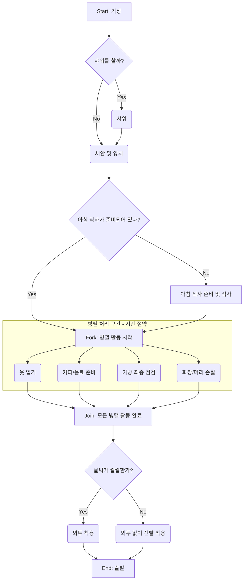

## 내용

6장. 동시성

### 항목 33. 시간적 결합 깨트리기

- 활동 다이어그램 활용으로 작업 흐름을 기록해보자.
- 다른 작업이 끝나기를 기다려야하는 대신, 생산적인 일을 cpu가 하도록 유도하자
- 출근 준비를 활동 다이어그램으로 표현하고 동시성을 증대할 방법 찾기.

### 항목 34. 공유 상태는 틀린 상태

- 불규칙한 실패는 동시성 문제인 경우가 많다
- 리소스를고려하는 환경에서 동시성은 어렵다
- **뮤텍스(Mutex), 세마포어(Semaphore), 모니터(Monitor)**는 모두 **동기화(Synchronization)**를 위한 도구이지만, 서로 **다른 개념과 사용 목적**을 가지고 있습니다.

---

## 🔑 주요 차이점

| 특징          | 뮤텍스 (Mutex)                                      | 세마포어 (Semaphore)                  | 모니터 (Monitor)                     |
| :------------ | :-------------------------------------------------- | :------------------------------------ | :----------------------------------- |
| **목적**      | **상호 배제 (Mutual Exclusion)**                    | **자원 개수 제어 및 동기화**          | **동기화 기법을 구조화**             |
| **자원 개수** | **1개 (Lock/Unlock)**                               | **N개 (0 이상의 정수)**               | 프로그래밍 언어 차원에서 제공        |
| **소유**      | Lock을 건 스레드만 Unlock 가능 (**소유 개념** 있음) | 소유 개념 없음. Wait/Signal 호출 가능 | 모니터에 진입한 스레드만 접근 가능   |
| **용도**      | **임계 영역 (Critical Section)** 보호               | 유한한 자원의 접근 제어 (예: 버퍼)    | 언어 차원의 상호 배제 및 조건 동기화 |
| **예시**      | 하나의 파일에 대한 동시 쓰기 방지                   | 프린터, 데이터베이스 연결 수 제한     | Java, C# 등 고급 언어에서 사용       |

---

## 🛠️ 각 도구의 상세 설명

### 뮤텍스 (Mutex)

**뮤텍스**는 "Mutual Exclusion"의 약자로, **하나의 스레드**만이 임계 영역에 접근할 수 있도록 보장하는 가장 기본적인 동기화 도구입니다.

- **동작:** `Lock`을 통해 접근을 잠그고, 작업을 마친 후 `Unlock`을 통해 잠금을 해제합니다.
- **특징:** Lock을 건 스레드만이 Unlock을 할 수 있는 **소유권 개념**이 있습니다.

### 세마포어 (Semaphore)

**세마포어**는 **가용한 자원의 개수**를 나타내는 정수 변수를 사용하며, 동시에 **여러 스레드**가 임계 영역에 접근할 수 있도록 허용할 때 사용됩니다.

- **동작:**
  - **Wait (또는 P):** 자원을 사용하기 전에 세마포어 값을 1 감소시키고, 값이 0보다 작으면 대기합니다.
  - **Signal (또는 V):** 자원 사용을 마친 후 세마포어 값을 1 증가시켜 대기 중인 스레드를 깨웁니다.
- **종류:**
  - **이진 세마포어 (Binary Semaphore):** 값이 0 또는 1만 가지며, 뮤텍스와 유사하게 사용되지만 **소유 개념이 없습니다**.
  - **계수 세마포어 (Counting Semaphore):** 2 이상의 값을 가지며 여러 자원을 제어합니다.

### 모니터 (Monitor)

**모니터**는 뮤텍스와 조건 변수를 **하나의 캡슐화된 구조**로 묶어 프로그래밍 언어 차원에서 **동기화를 쉽게 구현**하도록 만든 고급 동기화 도구입니다.

- **특징:** 모니터 내의 공유 데이터와 이 데이터를 조작하는 프로시저(메서드)들이 정의되어 있으며, **언제나 하나의 스레드**만이 모니터 내부의 프로시저를 실행할 수 있도록 보장합니다 (**상호 배제 자동 제공**).
- **추가 기능:** **조건 변수(Condition Variable)**를 통해 스레드 간의 복잡한 대기 및 신호 메커니즘(**조건 동기화**)을 처리할 수 있습니다.

세 도구 모두 여러 스레드가 공유 자원에 동시에 접근하면서 발생하는 **경쟁 조건(Race Condition)**을 막기 위해 사용되지만, **제공하는 기능과 구조적 접근 방식**에서 차이가 있습니다.
