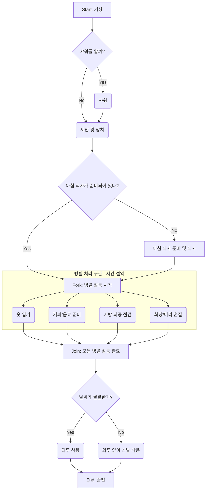

## 내용

6장. 동시성

### 항목 33. 시간적 결합 깨트리기

- 활동 다이어그램 활용으로 작업 흐름을 기록해보자.
- 다른 작업이 끝나기를 기다려야하는 대신, 생산적인 일을 cpu가 하도록 유도하자
- 출근 준비를 활동 다이어그램으로 표현하고 동시성을 증대할 방법 찾기.

### 항목 34. 공유 상태는 틀린 상태

- 불규칙한 실패는 동시성 문제인 경우가 많다
- 리소스를고려하는 환경에서 동시성은 어렵다
- **뮤텍스(Mutex), 세마포어(Semaphore), 모니터(Monitor)**는 모두 **동기화(Synchronization)**를 위한 도구이지만, 서로 **다른 개념과 사용 목적**을 가지고 있습니다.

---

## 🔑 주요 차이점

| 특징          | 뮤텍스 (Mutex)                                      | 세마포어 (Semaphore)                  | 모니터 (Monitor)                     |
| :------------ | :-------------------------------------------------- | :------------------------------------ | :----------------------------------- |
| **목적**      | **상호 배제 (Mutual Exclusion)**                    | **자원 개수 제어 및 동기화**          | **동기화 기법을 구조화**             |
| **자원 개수** | **1개 (Lock/Unlock)**                               | **N개 (0 이상의 정수)**               | 프로그래밍 언어 차원에서 제공        |
| **소유**      | Lock을 건 스레드만 Unlock 가능 (**소유 개념** 있음) | 소유 개념 없음. Wait/Signal 호출 가능 | 모니터에 진입한 스레드만 접근 가능   |
| **용도**      | **임계 영역 (Critical Section)** 보호               | 유한한 자원의 접근 제어 (예: 버퍼)    | 언어 차원의 상호 배제 및 조건 동기화 |
| **예시**      | 하나의 파일에 대한 동시 쓰기 방지                   | 프린터, 데이터베이스 연결 수 제한     | Java, C# 등 고급 언어에서 사용       |

---

## 🛠️ 각 도구의 상세 설명

### 뮤텍스 (Mutex)

**뮤텍스**는 "Mutual Exclusion"의 약자로, **하나의 스레드**만이 임계 영역에 접근할 수 있도록 보장하는 가장 기본적인 동기화 도구입니다.

- **동작:** `Lock`을 통해 접근을 잠그고, 작업을 마친 후 `Unlock`을 통해 잠금을 해제합니다.
- **특징:** Lock을 건 스레드만이 Unlock을 할 수 있는 **소유권 개념**이 있습니다.

### 세마포어 (Semaphore)

**세마포어**는 **가용한 자원의 개수**를 나타내는 정수 변수를 사용하며, 동시에 **여러 스레드**가 임계 영역에 접근할 수 있도록 허용할 때 사용됩니다.

- **동작:**
  - **Wait (또는 P):** 자원을 사용하기 전에 세마포어 값을 1 감소시키고, 값이 0보다 작으면 대기합니다.
  - **Signal (또는 V):** 자원 사용을 마친 후 세마포어 값을 1 증가시켜 대기 중인 스레드를 깨웁니다.
- **종류:**
  - **이진 세마포어 (Binary Semaphore):** 값이 0 또는 1만 가지며, 뮤텍스와 유사하게 사용되지만 **소유 개념이 없습니다**.
  - **계수 세마포어 (Counting Semaphore):** 2 이상의 값을 가지며 여러 자원을 제어합니다.

### 모니터 (Monitor)

**모니터**는 뮤텍스와 조건 변수를 **하나의 캡슐화된 구조**로 묶어 프로그래밍 언어 차원에서 **동기화를 쉽게 구현**하도록 만든 고급 동기화 도구입니다.

- **특징:** 모니터 내의 공유 데이터와 이 데이터를 조작하는 프로시저(메서드)들이 정의되어 있으며, **언제나 하나의 스레드**만이 모니터 내부의 프로시저를 실행할 수 있도록 보장합니다 (**상호 배제 자동 제공**).
- **추가 기능:** **조건 변수(Condition Variable)**를 통해 스레드 간의 복잡한 대기 및 신호 메커니즘(**조건 동기화**)을 처리할 수 있습니다.

세 도구 모두 여러 스레드가 공유 자원에 동시에 접근하면서 발생하는 **경쟁 조건(Race Condition)**을 막기 위해 사용되지만, **제공하는 기능과 구조적 접근 방식**에서 차이가 있습니다.

### 항목 34. 공유 상태는 틀린 상태

### 항목 35. 액터와 프로세스(내담당)

컴퓨터 공학에서 **액터 모델(Actor Model)**은 병렬 및 분산 컴퓨팅을 처리하기 위한 수학적 모델이자 설계 패러다임입니다. 1973년 칼 휴이트(Carl Hewitt) 등이 제안한 개념으로, 공유 메모리 방식의 문제점을 해결하기 위해 등장했습니다.

쉽게 비유하자면, 액터 모델은 각자의 우편함(Mailbox)을 가진 개별 우체국들이 서로 편지를 주고받으며 협업하는 시스템이라고 볼 수 있습니다.

1. 액터(Actor)의 3가지 핵심 규칙
   하나의 액터는 상태(State)와 행동(Behavior)을 가진 독립적인 연산 단위입니다. 메시지를 받은 액터는 다음 세 가지 중 하나 이상의 행동을 수행할 수 있습니다.

메시지 전송: 다른 액터에게 유한한 수의 메시지를 보냅니다.

새 액터 생성: 필요에 따라 새로운 액터를 만듭니다(자식 액터).

상태 변경: 다음 메시지를 처리할 때 사용할 자신의 상태를 지정합니다.

2. 액터 모델의 주요 특징

- 🔒 공유 메모리가 없음 (No Shared State)
  전통적인 병렬 프로그래밍에서는 여러 스레드가 하나의 메모리 공간에 접근할 때 **잠금(Lock)**이나 **뮤텍스(Mutex)**를 사용해야 합니다. 하지만 액터 모델은 각 액터가 자신만의 데이터를 독점하며, 오직 메시지를 통해서만 소통합니다. 따라서 데드락(Deadlock) 같은 복잡한 동기화 문제에서 자유롭습니다.

- 📨 비동기 통신 (Asynchronous Communication)
  액터는 메시지를 보내고 상대방의 응답을 기다리지 않습니다. 메시지는 상대방의 **우편함(Mailbox)**에 저장되며, 수신 측 액터는 자신의 속도에 맞춰 메시지를 순차적으로 처리합니다.

- 🛡️ 고립성 및 장애 허용 (Isolation & Fault Tolerance)
  한 액터에서 오류가 발생해도 다른 액터에게 직접적인 영향을 주지 않습니다. 부모 액터가 자식 액터의 상태를 감시하다가, 문제가 생기면 재시작하거나 중지시키는 감독(Supervision) 전략을 사용하기 때문에 시스템 전체의 안정성이 높습니다.

- 라이브러리 Akka Java 및 Scala에서 액터 모델을 사용할 수 있게 해주는 프레임워크.

3. Java Spring 기반 서버에서도 활용이 가능한가요?
   네, 가능합니다. 하지만 접근 방식에 따라 두 가지로 나뉩니다.

① Akka 프레임워크와 Spring 연동 (가장 일반적)
Spring은 기본적으로 '스레드 기반' 모델이지만, Akka 라이브러리를 추가하여 액터 모델을 구현할 수 있습니다.

Spring은 객체 관리(DI)와 DB 접근(JPA)을 담당하고, 핵심 비즈니스 로직이나 동시성 처리가 중요한 부분만 Akka 액터로 구현하여 섞어 씁니다.

spring-boot-starter와 Akka를 함께 설정하여 사용하며, 특히 Scala뿐만 아니라 Java API도 매우 잘 되어 있습니다.

② Spring WebFlux (액터 모델과 유사한 패러다임)
엄밀히 말하면 액터 모델은 아니지만, Spring 5부터 도입된 **WebFlux(Project Reactor)**는 액터 모델이 해결하고자 하는 '비동기 이벤트 기반 처리'와 'Non-blocking I/O'를 동일하게 지향합니다.

전통적인 1요청-1스레드 방식이 아니라, 적은 수의 스레드로 수만 개의 동시 연결을 처리한다는 점에서 액터 모델의 이점을 Spring 생태계 안에서 가장 유사하게 누릴 수 있는 방법입니다.

4. 사용 시나리오
   시나리오 A: 실시간 대규모 채팅 및 알림 시스템
   상황: 수백만 명의 사용자가 접속해 있고, 특정 방에 메시지를 전달해야 함.

활용: 각 채팅방을 하나의 '액터'로 만듭니다. 사용자가 메시지를 보내면 해당 방 액터에게 메시지를 전달하고, 방 액터는 그 방에 속한 사용자 액터들에게 메시지를 뿌려줍니다. 잠금(Lock) 없이 수만 개의 방을 독립적으로 관리할 수 있습니다.

시나리오 B: 이커머스 타임 세일 (재고 관리)
상황: 초당 수만 건의 결제 요청이 들어와 재고를 줄여야 함. DB Lock을 걸면 속도가 너무 느려짐.

활용: 특정 상품의 재고를 관리하는 '재고 액터'를 메모리에 띄웁니다. 모든 결제 요청은 이 액터에게 메시지로 전달됩니다. 액터는 메시지를 순차적으로(Single-threaded처럼) 처리하며 메모리상의 재고를 줄이고, 최종 결과만 비동기로 DB에 반영합니다. 동시성 이슈 없이 초고속 처리가 가능합니다.

5. 내생각

- 결국 전통적인 웹서비스에서는 액터를 사용한다 하더라도, 캐시와 같은 조치를 취하지 않는한, DB가 병목.
- 따라서 차이점 확인, 연구 조사, 부하테스트를 통해 현실적인 방법 탐색 필요.

### 항목 36. 칠판
