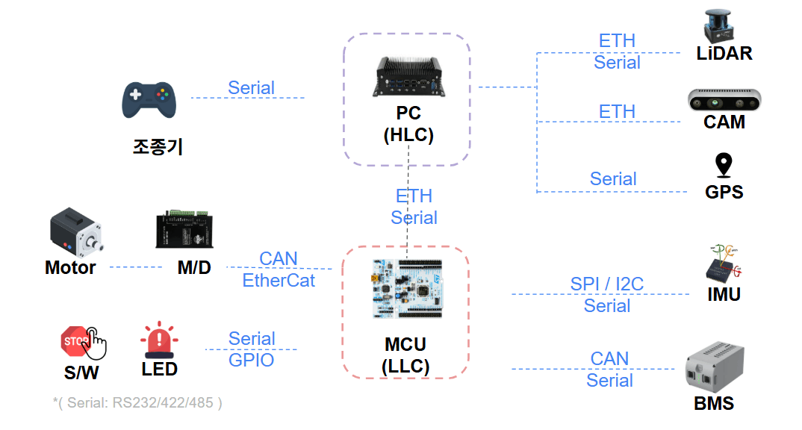

## 내용

지난주에 cpp 언어 공부를 끝내고, 가제보를 이용한 로봇팔 시뮬레이션을 진행하고 있다.
작업 목표 : 가상의 공간에서 로봇팔을 이용해서 공을 집고, 바구니에 넣는다. 위 작업을 사람의 개입 없이 자동으로 진행한다.

위 작업 목표를 위해 아래와 같은 계획을 세우고 진행중이다.
1. 로봇팔과, 바구니, 공을 시뮬레이션하기위한 모델 구축
2. 일단 키보드로 로봇팔을 움직여 본다.
3. 가상의 공간에서 로봇팔을 이용해서 공을 집고, 바구니에 넣는다. 자동으로 한다.

키보드로 로봇팔을 움직이는 작업은 성공했다.(중간에 일부 시행착오가 있었지만.)
단, 처음에 골랐던 로봇 팔은 집게(gripper)가 부착되어있지 않았던 것이라, 방법을 고민하던중 집게가 있는 모델을 사용하게 되었다.

2번 단계 까지 아래와 같이 끝났다.(사진 첨부)

이제 남은 3번단계.
사실 3번 단계에 대해서 ai와 내가 아는 지식을 토대로 토론해본 결과, 당장은 역기구학 없이(내가 아직 모르기도 하고) fixed point pose 방식으로 작업하기로 결정. 해당 작업은 오늘 진행해볼 예정이다.

현재 my_arm_with_ball_gazebo의 Pick & Place 기능은 고정 Joint Waypoint 기반으로 먼저 구현한다.

이후 기능을 단계적으로 발전시켜 IK → Trajectory / Motion Planning → TF2 → Vision → Feedback을 적용한다.

즉, 처음부터 모든 로봇공학 기술을 적용하지 않고, 동작 성공을 위한 최소 시스템을 먼저 완성한 뒤 각 단계의 수동 개입을 로봇공학 기술로 대체하는 방식을 선택한다.

그러기 위해서 단계를 다음과 같이 구상했다.

### 상태 머신

자동 동작은 다음 순서의 상태 머신으로 구현한다.

```text
HOME
  -> OPEN_GRIPPER
  -> APPROACH_BALL
  -> LOWER_TO_BALL
  -> CLOSE_GRIPPER
  -> LIFT_BALL
  -> MOVE_ABOVE_BASKET
  -> LOWER_INTO_BASKET
  -> OPEN_GRIPPER
  -> RETREAT
  -> RETURN_HOME
  -> DONE
```

#### 상태별 의미

| 상태 | 동작 |
|---|---|
| `HOME` | 시작 시 로봇의 기준 관절 자세. 완료 후에도 이 자세로 돌아온다. |
| `OPEN_GRIPPER` | 공에 접근하기 전에 RG2 손가락을 완전히 연다. |
| `APPROACH_BALL` | 공과 충돌하지 않도록 공 위쪽의 접근 자세로 이동한다. |
| `LOWER_TO_BALL` | 그리퍼가 공을 감쌀 수 있는 높이까지 천천히 내려간다. |
| `CLOSE_GRIPPER` | 두 손가락을 닫아 공을 잡는다. 닫힌 뒤 안정화 대기 시간을 둔다. |
| `LIFT_BALL` | 공을 바닥에서 들어 올려 운반 높이까지 올린다. |
| `MOVE_ABOVE_BASKET` | 공을 충분히 높이 든 상태로 바구니 위쪽으로 이동한다. |
| `LOWER_INTO_BASKET` | 공을 바구니 내부의 놓기 위치까지 내린다. |
| `OPEN_GRIPPER` | 그리퍼를 열어 공을 바구니에 놓는다. |
| `RETREAT` | 바구니와 충돌하지 않도록 위쪽으로 후퇴한다. |
| `RETURN_HOME` | 시작 시 기준 자세 또는 사전에 정의한 홈 자세로 복귀한다. |
| `DONE` | 동작 완료를 로그로 알리고 다음 시작 입력을 대기한다. |


### 기타 했던 작업.
* gazebo 튜토리얼 및 how to guide 내용확인 및 실습
* 인프런의 다음 강의 현직자가 알려주는 로보틱스 시스템 완전 해부 : 부품부터 통신까지(https://www.inflearn.com/course/a-complete-breakdown?cid=342721)를 키워드 위주로 공부하였다. 다음 개념들에 대한 이해를 넓혔다.